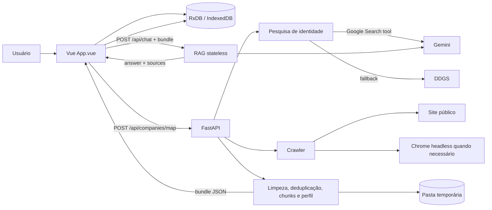
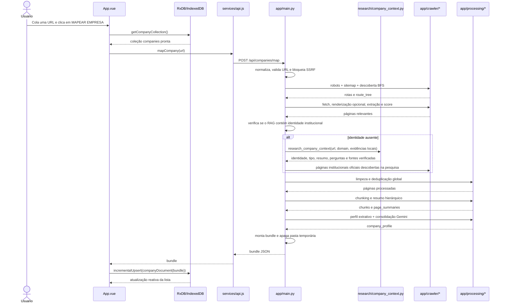
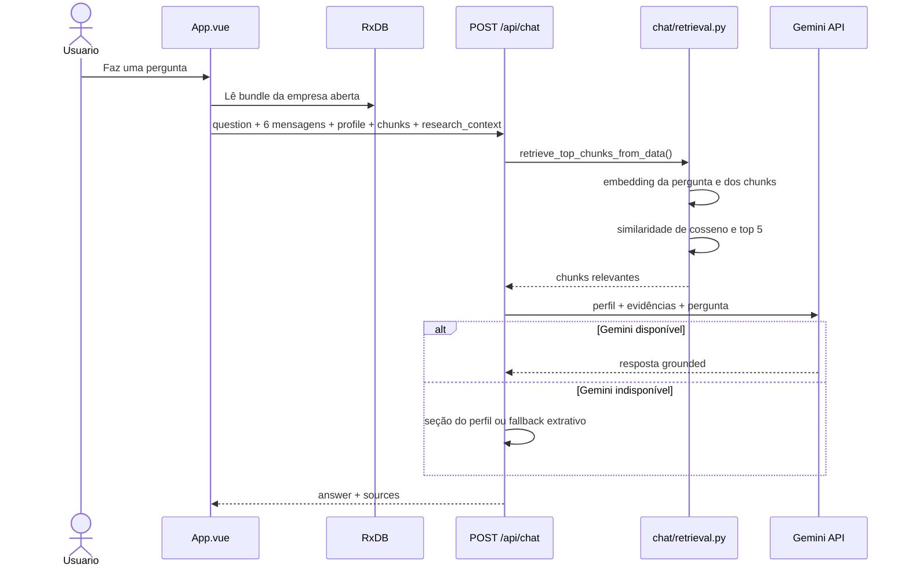

# Company Resume

## Como subir a aplicação

### Desenvolvimento: backend + frontend

Terminal 1, backend:

```bash
python3 -m venv .venv
source .venv/bin/activate
pip install -r backend/requirements.txt

cd backend
uvicorn app.main:app --reload --host 0.0.0.0 --port 61080
```

Terminal 2, frontend:

```bash
cd frontend
npm install
npm run dev
```

Abra `http://localhost:5173`. O Vite encaminha `/api` para `http://127.0.0.1:61080`.

### Rodar tudo pela porta do backend

```bash
cd frontend
npm install
npm run build

cd ../backend
uvicorn app.main:app --reload --host 0.0.0.0 --port 61080
```

Abra `http://localhost:61080`. Nesse modo o FastAPI serve o build do Vue em `frontend/dist`.

### Containers

Ainda não há `Dockerfile` nem `docker-compose*.yml` neste repositório. Quando os containers forem adicionados, o comando para subir tudo deve ficar aqui no topo, antes de qualquer explicação de arquitetura.

O Company Resume transforma um domínio público em uma base de conhecimento corporativa conversacional. A aplicação descobre páginas relevantes, extrai e deduplica conteúdo, cria resumos e chunks rastreáveis, monta um perfil empresarial grounded e permite perguntas usando um pipeline RAG.

O projeto foi desenhado como aplicação de portfólio sem autenticação e sem banco compartilhado. Cada visitante guarda suas próprias empresas localmente no navegador com RxDB sobre IndexedDB. O backend processa o site e responde ao chat, mas não mantém um catálogo global de consultas.

## Sumário

- [Objetivos de arquitetura](#objetivos-de-arquitetura)
- [Stack](#stack)
- [Visão geral](#visão-geral)
- [Fluxo completo do mapeamento](#fluxo-completo-do-mapeamento)
- [Fluxo arquivo por arquivo](#fluxo-arquivo-por-arquivo)
- [Pesquisa complementar e uso de ferramentas](#pesquisa-complementar-e-uso-de-ferramentas)
- [Crawler e seleção de páginas](#crawler-e-seleção-de-páginas)
- [Processamento e perfil corporativo](#processamento-e-perfil-corporativo)
- [RAG e fluxo do chat](#rag-e-fluxo-do-chat)
- [RxDB, privacidade e ciclo de vida](#rxdb-privacidade-e-ciclo-de-vida)
- [Contratos da API](#contratos-da-api)
- [Segurança](#segurança)
- [Estrutura do projeto](#estrutura-do-projeto)
- [Configuração e execução](#configuração-e-execução)
- [Deploy](#deploy)
- [Testes](#testes)
- [Decisões e limitações](#decisões-e-limitações)

## Objetivos de arquitetura

O projeto atende a quatro requisitos principais:

1. Extrair conhecimento útil de sites institucionais, portais, marketplaces e e-commerces sem depender exclusivamente de uma página `/sobre`.
2. Priorizar o conteúdo recuperado do próprio domínio e usar pesquisa externa apenas para resolver identidade ou tipo de site quando o RAG local não for suficiente.
3. Responder sem inventar fatos, preservando URLs próximas das afirmações e admitindo ausência de informação.
4. Isolar as consultas por navegador sem introduzir cadastro, autenticação ou um banco multiusuário.

## Stack

### Frontend

- Vue 3 com Composition API;
- Vite;
- RxDB 17;
- Dexie como storage adapter;
- IndexedDB como persistência física no navegador;
- RxJS para consultas reativas do RxDB;
- Fetch API para comunicação HTTP.

### Backend

- Python;
- FastAPI e Pydantic;
- HTTPX para HTTP assíncrono;
- Beautiful Soup e lxml para parsing;
- NumPy para vetores e similaridade;
- Gemini REST API para grounding, criação do perfil e respostas;
- DDGS como fallback de pesquisa pública sem chave;
- Chrome/Chromium headless como fallback para sites renderizados por JavaScript.

O projeto não depende de LangChain, LangGraph ou banco vetorial externo. O pipeline RAG e a orquestração das etapas foram implementados diretamente, deixando visível no código onde cada decisão ocorre.

## Visão geral



Há duas fronteiras de estado:

- o frontend mantém o estado durável da aplicação no IndexedDB;
- o backend mantém apenas arquivos e jobs transitórios durante uma requisição.

O resultado de uma empresa não é gravado de forma permanente no servidor.

## Fluxo completo do mapeamento

### Sequência de alto nível



### Ordem exata das operações

1. `frontend/src/App.vue` inicializa o banco usando `initDatabase()`.
2. O botão permanece como `PREPARANDO...` até a coleção `companies` estar disponível.
3. `mapNewCompany()` chama `getCompanyCollection()` antes de iniciar uma operação cara. Se IndexedDB estiver indisponível, o crawling nem começa.
4. `mapNewCompany()` chama `mapCompany(url)` em `frontend/src/services/api.js`.
5. `api.js` envia `POST /api/companies/map` com `{ "url": "..." }`.
6. `backend/app/main.py::map_company()` normaliza a URL, valida sintaxe, resolve DNS e confirma que o destino é público.
7. Um job transitório recebe um UUID apenas para progresso interno e identificação segura da pasta temporária.
8. `map_company_process()` cria `WORK_DIR/<slug>-<job_id>` no diretório temporário do sistema.
9. `robots.txt`, sitemaps e links internos alimentam a descoberta inicial de rotas.
10. As rotas são buscadas, extraídas e pontuadas por relevância; título, H1 e meta description também são preservados em páginas escassas.
11. O backend verifica se o conteúdo local contém identidade institucional explícita.
12. Somente quando essa identidade falta, uma pesquisa curta e neutra pelo domínio complementa a análise. A ausência de informação nunca define o tipo do site.
13. Páginas institucionais oficiais descobertas nessa pesquisa podem ser adicionadas ao crawl; páginas de produtos ou subprodutos não viram seeds de identidade.
14. O conteúdo selecionado é limpo e deduplicado entre todas as páginas.
15. Durante o processamento, artefatos intermediários são escritos na pasta temporária: páginas Markdown, chunks, resumos, contexto de pesquisa, árvore de rotas, perfil e metadados.
16. Cada página é dividida em chunks de até 1.500 caracteres e resumida hierarquicamente.
17. Um perfil corporativo extrativo é criado; quando há chave Gemini, o modelo tenta consolidá-lo em uma narrativa grounded.
18. O backend monta um `bundle` em memória com `metadata`, `company_profile`, `chunks`, `research_context`, `page_summaries` e `route_tree`.
19. A pasta temporária é removida antes da resposta. Um bloco `finally` também faz limpeza defensiva em falhas ou cancelamentos normais da requisição.
20. O job interno é removido da memória.
21. O bundle volta ao navegador.
22. `companyDocument()` transforma o bundle em um documento RxDB.
23. `incrementalUpsert()` insere a empresa ou substitui o mapeamento anterior com o mesmo slug.
24. A consulta reativa RxDB atualiza automaticamente os cards da interface.

Portanto, a persistência durável acontece somente depois que todo o processamento terminou e somente no navegador que iniciou a operação.

## Fluxo arquivo por arquivo

| Ordem | Arquivo / função | Responsabilidade | Próxima etapa |
|---:|---|---|---|
| 1 | `frontend/src/App.vue::mapNewCompany()` | Controla estado da tela, exige RxDB pronto e captura a URL | `services/api.js::mapCompany()` |
| 2 | `frontend/src/services/api.js::mapCompany()` | Serializa a requisição HTTP | `POST /api/companies/map` |
| 3 | `backend/app/main.py::map_company()` | Valida URL pública, cria job transitório e garante cleanup | `map_company_process()` |
| 4 | `backend/app/crawler/robots.py::read_robots_txt()` | Obtém e interpreta regras de crawling | descoberta de rotas |
| 5 | `backend/app/crawler/sitemap.py::discover_sitemap_urls()` | Descobre sitemaps e URLs declaradas | descoberta de rotas |
| 6 | `backend/app/crawler/route_discovery.py::discover_routes()` | Executa busca em largura em links internos | ranking de rotas |
| 7 | `backend/app/crawler/fetcher.py::fetch_html()` | Busca HTML e renderiza SPA quando necessário | extrator |
| 8 | `backend/app/crawler/extractor.py::extract_primary_content()` | Remove ruído e preserva blocos semânticos | score de relevância |
| 9 | `backend/app/crawler/relevance.py::score_url_and_content()` | Pontua URL, title, H1, meta e conteúdo | seleção das páginas |
| 10 | `backend/app/processing/summarizer.py::has_institutional_identity()` | Decide se a página já identifica a organização | pesquisa complementar, se necessária |
| 11 | `backend/app/research/company_context.py::research_company_context()` | Identifica entidade e tipo apenas quando falta identidade local | Gemini Search ou DDGS |
| 12 | `backend/app/processing/cleaner.py` | Normaliza texto e produz Markdown rastreável | deduplicação |
| 13 | `backend/app/processing/deduplicator.py` | Elimina parágrafos repetidos por hash | páginas processadas |
| 14 | `backend/app/processing/chunker.py` | Divide conteúdo e acrescenta metadados por chunk | resumo e bundle |
| 15 | `backend/app/processing/summarizer.py::summarize_page()` | Resume chunks e depois consolida a página | perfil |
| 16 | `backend/app/processing/profile_builder.py` | Constrói o perfil extrativo estruturado | Gemini opcional |
| 17 | `backend/app/processing/summarizer.py::summarize_company_profile()` | Consolida narrativa grounded ou usa fallback | bundle final |
| 18 | `backend/app/main.py` | Monta bundle, remove temporários e responde | frontend |
| 19 | `frontend/src/db/rxdb-setup.js::companyDocument()` | Normaliza o bundle para o schema local | `incrementalUpsert()` |
| 20 | RxDB / Dexie | Persiste em IndexedDB e emite atualizações reativas | renderização dos cards |

## Pesquisa complementar e uso de ferramentas

Sites como portais de notícias e marketplaces frequentemente não apresentam sua identidade na home. O sistema primeiro extrai o conteúdo do próprio site e só executa uma pesquisa curta quando não encontra identidade institucional suficiente. A consulta usa o domínio exato e termos neutros; ela não inclui rótulos como `marketplace`, evitando induzir a classificação.

### Gemini com Google Search grounding

`research_company_context()` chama `generate_grounded_content()`. O cliente Gemini envia um payload semelhante a:

```json
{
  "contents": [
    {
      "parts": [
        { "text": "Pesquise rapidamente a identidade do site..." }
      ]
    }
  ],
  "tools": [
    { "google_search": {} }
  ],
  "generationConfig": {
    "temperature": 0.1,
    "maxOutputTokens": 1200
  }
}
```

Esse é o uso de uma ferramenta nativa do Gemini. O modelo pode acionar `google_search`, e a API devolve `groundingMetadata` com:

- consultas realizadas;
- URLs encontradas;
- títulos das fontes;
- chunks de grounding.

O backend normaliza a resposta para:

```json
{
  "entity_name": "Nome identificado",
  "site_type": "portal_de_conteudo",
  "summary": "Resumo verificado da identidade",
  "organization_name": "Organização relacionada",
  "relationship": "Relação entre domínio, marca e organização",
  "content_focus": ["Notícias", "Esportes"],
  "suggested_questions": ["Quais notícias estão em destaque?"],
  "confidence": "alta",
  "sources": [],
  "search_queries": [],
  "provider": "gemini_google_search"
}
```

### Isso é function calling?

O projeto implementa **tool use com a ferramenta nativa `google_search` do Gemini**, que pertence à mesma família conceitual de function/tool calling. Porém, ele não implementa atualmente um loop de function calling com funções de aplicação declaradas por JSON Schema, como `crawl_page(url)` ou `save_company(bundle)` escolhidas autonomamente pelo modelo.

Essa distinção é importante:

- o Gemini decide usar a ferramenta de busca oferecida pela própria API;
- o Python continua responsável por controlar crawling, segurança, persistência temporária e RAG;
- o modelo não recebe acesso direto ao filesystem, ao RxDB ou às funções internas;
- não há agente autônomo nem grafo LangGraph coordenando ferramentas.

Isso mantém o fluxo determinístico: a IA ajuda na identificação e na narrativa, enquanto operações com efeitos colaterais continuam explícitas no código.

### Fallback DDGS

Quando não há chave Gemini, a cota falha ou a resposta grounded é inválida, o sistema usa DDGS em uma thread para não bloquear o event loop. Os backends são tentados isoladamente:

1. Wikipedia;
2. Bing;
3. Brave;
4. DuckDuckGo.

Os resultados são pontuados. Fontes do domínio em páginas institucionais recebem maior prioridade, seguidas por Wikipedia, páginas do próprio domínio e títulos compatíveis com a marca.

O fallback classifica cada resultado separadamente e pondera evidências alinhadas à entidade raiz. Uma ocorrência isolada em um subproduto não classifica todo o domínio: por exemplo, uma página de Cloud Marketplace não transforma um mecanismo de busca em marketplace. Esse rótulo exige evidência explícita de intermediação entre compradores e vendedores. Catálogo ou conteúdo escasso, por si só, não é evidência.

Consultas neutras de finalidade e identidade são tentadas em provedores isolados, dentro de um orçamento total de 30 segundos. Resultados genéricos de baixa confiança não encerram a pesquisa, e uma página como “Google Sites” não pode representar `google.com` apenas por compartilhar a marca. O tipo `mecanismo_de_busca` possui perguntas próprias e é reconhecido por descrições explícitas da função de pesquisar e encontrar informações.

### Prioridade do RAG sobre a pesquisa externa

A pesquisa externa não substitui o conteúdo rastreado.

`has_institutional_identity()` procura evidências explícitas em:

- rotas como `/sobre`, `/quem-somos`, `/institucional`, `/about` e `/nossa-historia`;
- títulos institucionais;
- frases de identidade presentes na home.

Se a identidade existe no RAG, ela tem prioridade total e a pesquisa externa nem é executada. Se não existe, o contexto externo só pode preencher `Resumo executivo` e `Quem é` quando contém entidade, confiança alta ou média e ao menos uma fonte HTTP(S), mantendo linhas `Fonte externa: URL`.

Somente páginas de identidade do mesmo domínio, como `/sobre`, `/about`, `/institucional` e `/quem-somos`, podem virar seeds adicionais do crawler. Páginas de catálogo, marketplace de um subproduto e fontes externas, como Wikipedia, podem ajudar na pesquisa, mas não são rastreadas como páginas institucionais da entidade.

### Avaliação de suficiência do conteúdo

O bundle inclui `metadata.content_assessment`, que separa volume textual de identidade institucional. Os estados são `escasso`, `sem_identidade_institucional` e `suficiente`; a avaliação também registra se a página inicial é escassa. Quando necessário, o perfil explica:

- que a página inicial ou o site forneceu pouco texto útil;
- quais títulos e rotas foram realmente observados;
- se subpáginas trouxeram apenas conteúdo de produtos ou serviços;
- se a identidade veio de pesquisa pública verificável;
- ou se nem a pesquisa complementar encontrou evidência suficiente.

Rotas de subprodutos, como `/docs/about`, continuam disponíveis como conteúdo do RAG, mas não são tratadas como página institucional da entidade raiz.

## Crawler e seleção de páginas

### Normalização e SSRF

Antes de qualquer acesso, a URL é canonicalizada. Fragmentos e parâmetros de tracking são removidos, parâmetros restantes são ordenados e caminhos equivalentes são normalizados.

`ensure_public_url()`:

- aceita apenas HTTP e HTTPS;
- rejeita credenciais embutidas;
- aceita somente portas 80 e 443;
- resolve DNS de forma assíncrona;
- rejeita localhost, redes privadas, link-local e endereços não globais;
- revalida cada destino durante redirecionamentos.

### Robots e sitemaps

O crawler consulta `/robots.txt` usando `CompanyResumeBot/1.0` e respeita as regras por meio de `urllib.robotparser`.

Os caminhos iniciais de sitemap são:

- `/sitemap.xml`;
- `/sitemap_index.xml`;
- `/wp-sitemap.xml`.

Sitemap indexes são percorridos com limite de 20 documentos XML.

### Descoberta de rotas

`discover_routes()` usa BFS, ou busca em largura, com:

- profundidade máxima `2`;
- limite de descoberta igual a `MAX_PAGES * 4`, atualmente 120 rotas;
- apenas domínio principal e subdomínios válidos;
- bloqueio de extensões binárias e arquivos não HTML;
- descarte antecipado de login, checkout, carrinho, feeds, paginação e outras rotas de pouco valor;
- limite de sete artigos para evitar que blogs dominem o corpus;
- cache de HTML dentro da própria execução.

A home pode ser renderizada com JavaScript durante a descoberta para revelar navegação criada no cliente. Nas demais rotas, o Chrome é usado mais tarde, apenas se o HTML bruto não tiver conteúdo principal suficiente.

### Fetch e renderização JavaScript

`fetch_url()` usa HTTPX sem seguir redirects automaticamente. Cada salto é validado antes do próximo request.

Limites atuais:

| Configuração | Valor |
|---|---:|
| Timeout HTTP | 10 segundos |
| Delay global entre requests | 1 segundo |
| Redirecionamentos | até 6 tentativas |
| Tamanho máximo por página | 5 MB |
| Timeout do Chrome | 20 segundos |
| Virtual time budget | 5 segundos |

Se o extrator encontrar menos de 200 caracteres úteis, `fetch_html()` tenta Chrome/Chromium headless. A renderização usa modo incógnito, extensões desabilitadas, limite de tempo e regras de resolução de host restritas ao domínio solicitado.

Se o Chrome não estiver disponível ou a renderização falhar, o HTML original ainda pode ser analisado.

### Extração principal

`extract_primary_content()` remove:

- `script`, `style`, `noscript`, `svg`, `canvas` e `iframe`;
- navegação, rodapé e formulários;
- elementos classificados como cookie, newsletter, popup, modal, menu, sidebar, anúncio ou banner.

O extrator prioriza `main`, depois `article`, `body` e finalmente o documento inteiro. H1, H2 e H3 são preservados como Markdown; parágrafos, itens de lista e tabelas curtos demais são descartados.

### Relevance scoring

Cada candidata é pontuada usando:

- URL e path;
- `<title>`;
- H1;
- meta description;
- conteúdo extraído;
- palavras institucionais em português e inglês;
- bônus para `/sobre`, serviços, contato, carreiras, cases e conteúdo empresarial;
- penalizações para login, carrinho, busca, tags, autores e paginação.

A home é preservada como referência mesmo quando seu score é baixo. Demais páginas precisam ter ao menos 200 caracteres e score positivo. No máximo 30 páginas chegam ao corpus final.

## Processamento e perfil corporativo

### Limpeza e deduplicação

`clean_text()` normaliza espaços sem destruir a separação em parágrafos.

`deduplicate_paragraphs()` normaliza cada parágrafo, calcula SHA-256 e elimina repetições. Além da deduplicação dentro de uma página, `map_company_process()` mantém um conjunto global para evitar que menus, avisos e textos repetidos apareçam em várias páginas do mesmo mapeamento.

Cada página aceita também é escrita temporariamente em Markdown com front matter:

```markdown
---
url: https://example.com/sobre
title: "Quem somos"
mapped_at: 2026-08-14T00:00:00+00:00
---

# Quem somos

Conteúdo processado...
```

Esses arquivos existem apenas como artefatos intermediários rastreáveis. Eles são apagados após a criação do bundle.

### Chunking

`chunk_text()` produz chunks de até 1.500 caracteres:

- tenta preservar parágrafos inteiros;
- divide blocos longos por sentença;
- divide sentenças excepcionalmente longas por tamanho;
- mantém título, URL, empresa e `chunk_id` em cada documento.

Exemplo:

```json
{
  "company": "example-com",
  "url": "https://example.com/servicos",
  "title": "Serviços",
  "section": "Serviços",
  "chunk_id": "servicos-001",
  "content": "Conteúdo recuperável..."
}
```

### Resumo hierárquico

O resumo local é extrativo e acontece em duas camadas:

1. cada chunk é resumido por frequência de termos e seleção de sentenças;
2. os resumos dos chunks são consolidados no resumo da página.

Isso reduz o volume enviado ao Gemini para construir o perfil e preserva o texto integral nos chunks usados pelo retrieval.

### Perfil extrativo

`build_company_profile()` organiza evidências nas seções:

- Resumo executivo;
- Quem é;
- História;
- Missão;
- Visão;
- Valores;
- Posicionamento;
- Principais serviços e produtos;
- Tecnologias e segmentos;
- Clientes e cases;
- Diferenciais;
- Cultura e carreiras;
- temas recorrentes;
- informações para candidatos;
- pontos não esclarecidos;
- fontes e data.

Cada seção é preenchida por regras explícitas de palavras-chave. Quando não há evidência, o perfil diz `Não identificado no conteúdo público analisado.` em vez de completar lacunas com conhecimento genérico.

### Consolidação com Gemini

Quando uma chave está configurada, `summarize_company_profile()` pede ao Gemini uma narrativa mais coesa com temperatura `0.1`, mantendo a estrutura Markdown e URLs próximas das afirmações.

O prompt determina que:

- o RAG do site tem prioridade;
- contexto externo só preenche identidade ausente;
- afirmações externas recebem `Fonte externa: URL`;
- catálogos devem ser agrupados em capacidades, não reproduzidos como listas enormes;
- fatos ausentes não podem ser inventados.

Se o Gemini falhar, retornar formato inválido ou todos os modelos ficarem indisponíveis, o perfil extrativo continua sendo um resultado válido.

### Roteamento entre modelos Gemini

`backend/app/gemini_client.py` tenta modelos em sequência. `GEMINI_MODEL` pode definir o preferido, mas os demais permanecem como fallback.

Há uma lista específica para modelos compatíveis com `google_search`, configurável por `GEMINI_SEARCH_MODEL`. Erros HTTP, indisponibilidade e cota em um modelo fazem o cliente tentar o próximo.

## RAG e fluxo do chat

### O que fica armazenado

O navegador mantém o corpus em forma de bundle, mas não armazena uma matriz NumPy de embeddings:

```json
{
  "metadata": {},
  "company_profile": "# Empresa...",
  "chunks": [],
  "research_context": {},
  "page_summaries": [],
  "route_tree": {}
}
```

Os vetores são baratos e determinísticos, então são recalculados no backend em cada pergunta. Essa escolha simplifica o documento RxDB, evita serializar matrizes binárias e mantém o backend stateless.

### Sequência do chat



### Embeddings locais

`simple_embedding()` implementa feature hashing determinístico:

1. normaliza acentos e caixa;
2. extrai tokens alfanuméricos;
3. acrescenta bigramas adjacentes;
4. aplica BLAKE2b em cada feature;
5. projeta sinais em um vetor de 384 dimensões;
6. normaliza o vetor por norma L2.

A pergunta passa pelo mesmo processo. `top_k_matches()` calcula similaridade de cosseno e retorna os cinco chunks mais próximos.

No endpoint stateless são considerados no máximo 200 chunks, com até 5.000 caracteres por chunk, como contenção de custo e payload.

Essa estratégia não possui a qualidade semântica de um modelo neural de embeddings, mas tem vantagens para um portfólio:

- não consome outra API;
- não exige banco vetorial;
- não guarda vetores no servidor;
- é reproduzível e barato;
- funciona offline depois que o corpus chegou ao backend da pergunta.

### Geração e fallback

O chat identifica intenções como serviços, produtos, identidade, valores, tecnologia, carreira, missão e história. Essa detecção permite usar a seção correspondente do perfil como fallback confiável.

Com Gemini disponível, o prompt recebe:

- pergunta atual;
- até seis mensagens recentes;
- até 16.000 caracteres do perfil;
- até cinco chunks recuperados, limitados a 1.200 caracteres cada;
- instruções contra invenção e extrapolação.

A saída é sanitizada, limitada a quatro parágrafos e rejeitada quando parece truncada ou curta demais. Se a geração falhar:

1. tenta a seção específica do perfil;
2. para perguntas abertas, seleciona sentenças dos chunks com sobreposição lexical;
3. se ainda não houver evidência, admite que o conteúdo público não é suficiente.

As fontes retornadas vêm dos chunks recuperados. Em perguntas `Quem é`, fontes da pesquisa externa também podem ser incluídas.

## RxDB, privacidade e ciclo de vida

### Schema local

O banco se chama `companyresumebrowser` e contém a coleção `companies`:

| Campo | Tipo | Uso |
|---|---|---|
| `id` | string | slug do domínio e chave primária |
| `name` | string | nome exibido |
| `domain` | string | domínio de origem |
| `sourceUrl` | string | URL usada para atualizar |
| `mappedAt` | string | data do mapeamento |
| `pagesProcessed` | number | métrica para o card |
| `updatedAt` | number | índice usado na ordenação |
| `bundle` | string | bundle completo serializado em JSON |

O plugin `RxDBQueryBuilderPlugin` habilita a ordenação reativa por `updatedAt`, e `RxDBUpdatePlugin` suporta operações de atualização. Dexie conecta o RxDB ao IndexedDB.

### Inicialização defensiva

`initDatabase()` mantém uma promise singleton para evitar inicializações concorrentes. Em falha, a promise é descartada para permitir nova tentativa.

`App.vue`:

- detecta ausência de IndexedDB;
- bloqueia o botão até a coleção existir;
- abre o banco antes de chamar o backend;
- apresenta erros de storage em vez de iniciar um crawling que não poderá ser salvo;
- assina `collection.find().sort({ updatedAt: 'desc' }).$` para atualização reativa.

### Isolamento

Não há `user_id`, cookie de sessão ou autenticação. O isolamento é fornecido pela origem e pelo perfil do navegador:

- Chrome e Firefox mantêm IndexedDB separados;
- perfis diferentes do mesmo navegador não compartilham dados;
- navegação anônima usa armazenamento separado e normalmente efêmero;
- outro visitante da aplicação recebe seu próprio banco vazio;
- limpar os dados do site remove os documentos locais.

O endpoint `GET /api/companies` sempre retorna `[]`. Endpoints antigos que tentavam ler, atualizar ou excluir uma empresa por slug respondem `410 Gone`, impedindo que o servidor volte a ser usado como catálogo compartilhado.

### Atualização e exclusão

Atualizar executa todo o pipeline novamente usando `sourceUrl`. O novo bundle só substitui o documento local depois de uma resposta bem-sucedida; um erro no crawling preserva o mapeamento anterior.

Excluir chama `document.remove()` no RxDB. Nenhuma chamada destrutiva é enviada ao backend porque não há registro durável correspondente no servidor.

## Contratos da API

### Health check

```http
GET /api/health
```

```json
{ "status": "ok" }
```

### Mapear empresa

```http
POST /api/companies/map
Content-Type: application/json
```

```json
{
  "url": "https://www.example.com/"
}
```

Resposta simplificada:

```json
{
  "metadata": {
    "name": "Example",
    "slug": "example-com",
    "domain": "example.com",
    "source_url": "https://www.example.com/",
    "status": "ready",
    "pages_discovered": 20,
    "pages_selected": 8,
    "pages_processed": 7,
    "chunks": 31,
    "site_type": "empresa",
    "identity_source": "rag",
    "profile_generation": "gemini"
  },
  "company_profile": "# Example...",
  "chunks": [],
  "research_context": {},
  "page_summaries": [],
  "route_tree": {}
}
```

O mapeamento é síncrono do ponto de vista HTTP: a conexão permanece aberta enquanto o pipeline executa. Jobs não são expostos para polling porque instâncias serverless diferentes não compartilham memória.

### Perguntar

```http
POST /api/chat
Content-Type: application/json
```

```json
{
  "question": "Quem é esta empresa?",
  "history": [
    { "role": "user", "content": "O que ela oferece?" },
    { "role": "assistant", "content": "..." }
  ],
  "company": {
    "profile": "# Example...",
    "chunks": [],
    "research_context": {}
  }
}
```

```json
{
  "answer": "Resposta grounded em até quatro parágrafos.",
  "sources": [
    "https://www.example.com/sobre"
  ]
}
```

O histórico existe apenas em memória no componente Vue durante a tela atual e são enviados no máximo seis itens.

### Códigos relevantes

| Código | Situação |
|---:|---|
| `200` | operação concluída |
| `400` | URL inválida, privada ou não resolvida |
| `410` | endpoint antigo de persistência compartilhada desativado |
| `422` | o site não produziu conteúdo útil ou houve falha no pipeline |

## Segurança

### Proteções implementadas

- validação de esquema, host, porta, DNS e IP;
- bloqueio de redes privadas e locais contra SSRF;
- revalidação manual de redirects;
- limite de seis redirecionamentos;
- filtro de Content-Type;
- limite de 5 MB por página;
- timeout HTTP e de renderização;
- rate limit global simples de um segundo;
- respeito a `robots.txt`;
- bloqueio de extensões binárias;
- escopo de crawling restrito ao domínio e subdomínios;
- limites de profundidade, páginas, artigos e chunks;
- Chrome headless isolado, incógnito e sem extensões;
- validação Pydantic no chat;
- remoção de temporários e jobs ao terminar;
- ausência de endpoint para listar dados de outros navegadores.

### O que o modelo pode e não pode fazer

O Gemini recebe texto e, no fluxo de pesquisa, acesso à ferramenta nativa Google Search. Ele não recebe:

- acesso ao shell;
- acesso ao IndexedDB;
- acesso direto ao filesystem;
- credenciais além do uso interno da API;
- uma função genérica para buscar URLs arbitrárias;
- permissão para salvar ou excluir dados.

## Estrutura do projeto

```text
company-resume/
├── backend/
│   ├── .env
│   ├── requirements.txt
│   ├── main.py                       # entrypoint Vercel: exporta app
│   ├── app/
│   │   ├── main.py                  # API e orquestração do mapeamento
│   │   ├── config.py                # limites e diretórios
│   │   ├── models.py                # contratos Pydantic
│   │   ├── gemini_client.py         # REST, tool use e fallback de modelos
│   │   ├── crawler/
│   │   │   ├── security.py          # SSRF e validação DNS/IP
│   │   │   ├── fetcher.py           # HTTPX e Chrome headless
│   │   │   ├── robots.py            # robots.txt
│   │   │   ├── sitemap.py           # sitemap e sitemap index
│   │   │   ├── route_discovery.py   # BFS e route tree
│   │   │   ├── extractor.py         # conteúdo principal
│   │   │   ├── relevance.py         # score institucional
│   │   │   └── url_normalizer.py    # canonicalização
│   │   ├── processing/
│   │   │   ├── cleaner.py           # limpeza e Markdown
│   │   │   ├── deduplicator.py      # SHA-256 por parágrafo
│   │   │   ├── chunker.py            # chunks rastreáveis
│   │   │   ├── embeddings.py         # feature hashing e cosseno
│   │   │   ├── profile_builder.py    # perfil extrativo
│   │   │   └── summarizer.py         # resumos e Gemini
│   │   ├── research/
│   │   │   └── company_context.py    # grounding e DDGS
│   │   ├── chat/
│   │   │   ├── retrieval.py          # top-k stateless
│   │   │   └── service.py            # resposta e fallback
│   │   └── jobs/
│   │       └── mapper.py              # estado interno transitório
│   └── tests/
│       └── test_company_resume.py
├── frontend/
│   ├── package.json
│   ├── vite.config.js
│   └── src/
│       ├── main.js
│       ├── App.vue                    # interface e fluxo local
│       ├── style.css
│       ├── db/
│       │   └── rxdb-setup.js          # schema RxDB/Dexie
│       └── services/
│           └── api.js                 # contratos HTTP
├── vercel.json
└── README.md
```

Os módulos `storage/` e o wrapper legado `answer_question(company_slug, ...)` permanecem apenas para compatibilidade e testes de dados locais antigos. O fluxo web atual usa `answer_question_from_context()` e não lê empresas do filesystem.

## Configuração e execução

### Backend

```bash
python3 -m venv .venv
source .venv/bin/activate
pip install -r backend/requirements.txt

cd backend
uvicorn app.main:app --reload --host 0.0.0.0 --port 61080
```

### Frontend

Em outro terminal:

```bash
cd frontend
npm install
npm run dev
```

Abra `http://localhost:5173`. O proxy definido em `vite.config.js` encaminha `/api` para `http://127.0.0.1:61080`.

Durante o desenvolvimento, essa opção oferece hot reload. Para executar tudo pela porta do FastAPI, gere o build e abra `http://localhost:61080`:

```bash
cd frontend
npm run build

cd ../backend
uvicorn app.main:app --reload --host 0.0.0.0 --port 61080
```

O FastAPI serve `frontend/dist/index.html` e os arquivos de `frontend/dist/assets`. Isso garante que a porta `61080` use o mesmo frontend Vue/RxDB do deploy, em vez da interface legada baseada em polling de jobs.

### Variáveis de ambiente

Crie `backend/.env`:

```dotenv
# Aceita qualquer uma das duas
GEMINI_API_KEY=sua-chave
# GOOGLE_API_KEY=sua-chave

# Opcionais: modelo preferido antes dos fallbacks
# GEMINI_MODEL=gemini-2.5-flash-lite
# GEMINI_SEARCH_MODEL=gemini-2.5-flash-lite

# Opcional: executável para páginas JavaScript
# CHROME_BINARY=/usr/bin/google-chrome

# Opcional: diretório transitório
# COMPANY_RESUME_WORK_DIR=/tmp/company-resume
```

Sem Gemini, crawling, perfil extrativo, embeddings, retrieval e chat determinístico continuam disponíveis. A pesquisa prévia tenta DDGS.

## Deploy

`vercel.json` usa Vercel Services, seguindo a mesma divisão frontend/backend do Catequista, mas com a configuração atual de entrypoint recomendada para Python:

- `frontend`: raiz `frontend`, framework Vite;
- `backend`: raiz `backend`, framework FastAPI e entrypoint ASGI `main:app`;
- `backend/main.py`: wrapper mínimo que exporta `app` de `app.main`;
- `maxDuration`: 300 segundos para funções Python do serviço backend.

Configuração completa:

```json
{
  "$schema": "https://openapi.vercel.sh/vercel.json",
  "services": {
    "frontend": {
      "root": "frontend",
      "framework": "vite"
    },
    "backend": {
      "root": "backend",
      "framework": "fastapi",
      "entrypoint": "main:app",
      "functions": {
        "**/*.py": {
          "maxDuration": 300
        }
      }
    }
  },
  "rewrites": [
    { "source": "/api/(.*)", "destination": { "type": "service", "service": "backend" } },
    { "source": "/(.*)", "destination": { "type": "service", "service": "frontend" } }
  ]
}
```

Rewrites:

```text
/api/*  -> backend
/*      -> frontend
```

Configure `GEMINI_API_KEY` no ambiente do deploy. Não é necessário provisionar Postgres, Redis, Blob, S3 ou autenticação para persistir empresas, pois os bundles ficam em IndexedDB.

O backend usa apenas o diretório temporário da instância. Isso é compatível com filesystem efêmero, desde que a plataforma permita completar a requisição de mapeamento dentro de seu limite de execução.

### Checklist na Vercel

1. Crie ou importe o repositório como um único projeto.
2. Em **Settings → Build and Deployment**, selecione o framework/preset **Services**. A presença de `services` no JSON não ativa esse modo sozinha.
3. Mantenha o diretório raiz do projeto apontando para a raiz do repositório, não para `frontend` ou `backend`.
4. Ative ou mantenha **Fluid compute**. O backend de Services usa esse modo por padrão e o plano Hobby admite até 300 segundos.
5. Cadastre `GEMINI_API_KEY` nos ambientes Production, Preview e Development que desejar.
6. Opcionalmente cadastre `GEMINI_MODEL` e `GEMINI_SEARCH_MODEL`.
7. Faça primeiro um deploy de Preview e valide `/api/health` antes do mapeamento completo.
8. Valide um site HTML simples e depois um portal ou marketplace.

Referências oficiais: [Vercel Services](https://vercel.com/kb/guide/vercel-services), [Services com Fluid compute](https://vercel.com/kb/guide/vercel-services-fluid-compute), [FastAPI na Vercel](https://vercel.com/docs/frameworks/backend/fastapi) e [duração de Functions](https://vercel.com/docs/functions/configuring-functions/duration).

### Observação sobre Chrome headless

O runtime Python padrão não garante a presença de Google Chrome. Sites que já entregam HTML útil continuam funcionando; sites totalmente dependentes de JavaScript podem cair no HTML bruto e produzir menos páginas. Se renderização headless for indispensável em produção, a evolução apropriada é usar um serviço com runtime de container e Chrome instalado ou um renderizador externo controlado.

## Testes

### Backend

```bash
cd backend
python -m pytest -q
```

A suíte cobre, entre outros pontos:

- roteamento e fallback Gemini;
- preservação das fontes de grounding;
- classificação de portais e marketplaces;
- regressões para Google Search, Google Sites e Cloud Marketplace;
- avaliação e narrativa de páginas iniciais escassas;
- uso condicionado da identidade externa;
- seeds oficiais do mesmo domínio;
- canonicalização;
- SSRF;
- robots e sitemap;
- extração, renderização e relevância;
- embeddings;
- perfil e respostas grounded;
- ausência de catálogo compartilhado;
- chat stateless com contexto enviado pelo navegador.

### Frontend

```bash
cd frontend
npm run build
npm audit --omit=dev
```

O build de produção e a inicialização real de RxDB/IndexedDB foram validados em Chrome headless. As dependências de produção estão sem vulnerabilidades conhecidas na auditoria atual.

## Decisões e limitações

### Por que RxDB no navegador?

Para um portfólio público, autenticação e persistência central aumentariam custo e complexidade sem melhorar a demonstração principal. IndexedDB oferece isolamento natural por origem e capacidade suficiente para perfis e chunks de algumas empresas.

### Por que não persistir embeddings?

Os embeddings usados são pequenos e baratos de recalcular. Persistir somente texto torna o bundle portável e evita problemas de serialização de arrays NumPy.

### Por que não usar um banco vetorial?

O objetivo é demonstrar as etapas do RAG sem infraestrutura adicional. Para escala maior, os pontos naturais de evolução seriam embeddings neurais e um índice vetorial local no browser ou remoto com isolamento por usuário.

### Por que o mapeamento é uma chamada síncrona?

Um job em memória poderia ser criado em uma instância serverless e consultado em outra, produzindo polling inconsistente. A chamada síncrona mantém todos os artefatos na mesma execução e entrega o bundle diretamente ao cliente. A contrapartida é depender do limite de duração da plataforma.

### Limitações conhecidas

- storage local é específico da origem; mudar domínio de deploy cria outro IndexedDB;
- limpar os dados do site remove todos os mapeamentos locais;
- não há sincronização entre dispositivos;
- o histórico do chat não é persistido;
- o retrieval por feature hashing é lexical, não um embedding semântico neural;
- alguns sites bloqueiam bots, exigem consentimento, autenticação ou desafios anti-automação;
- Chrome pode não estar presente em todos os ambientes serverless;
- o crawler não processa PDFs, vídeos ou documentos anexos;
- o endpoint de chat recebe o corpus do navegador, portanto o payload cresce com a quantidade de chunks;
- resultados externos dependem de cota Gemini ou disponibilidade dos mecanismos usados pelo DDGS;
- o modelo melhora o storytelling, mas não pode criar fatos ausentes das fontes.

## Resultado arquitetural

O Company Resume combina uma parte determinística — segurança, crawling, seleção, deduplicação, chunking, retrieval e persistência — com IA em pontos controlados: identificação grounded, consolidação narrativa e resposta conversacional.

Essa separação é intencional. O modelo trabalha onde linguagem e ambiguidade importam; o código mantém controle sobre rede, arquivos, limites, fontes e efeitos colaterais. O resultado é um RAG pequeno, auditável, barato de operar e adequado para demonstrar uma arquitetura real em um projeto de portfólio.
